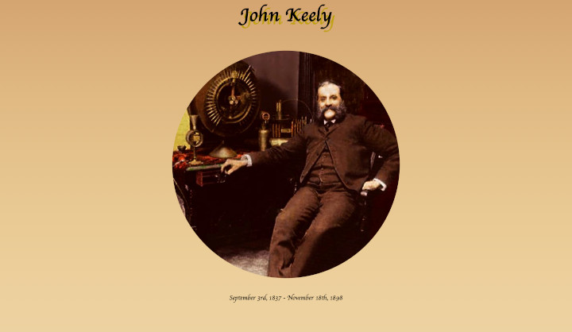

# [Tribute Page v2]()
An improved version of my original FCC project.

## Purpose/Goal
To remake my original tribute page with the skills I've learned over the past couple of years.  
To improve upon the original and display the difference between where I started and where I'm at now.

## Operation
N/A

## Tech/Libraries Used
* HTML
* CSS
* JavaScript
* React

## Problems/Solutions
* Getting the page's scroll information and applying it within React took a little research. I hade to refresh my knowledge about references within React. This was the first time I applied an effect that depending on the scroll position within the page.
* Getting the bullets to slide in from the sides when within the viewable screen area required looking into several different approaches like IntersectionObserver API, using state Hooks for a functional component version of the site, and more. However I settled on using the window's properties and getting the bounding rect of the elements to then let me change the stylings based on where it was on the screen. I made it a one way change so that the elements stay where they are after they move.
* I had to find the right color palette for this project. I chose to use the colors from the main image even though all of the other images are in black and white. I think it works out better than just a grayscale theme.

## More Information
[Color palette from paletton](https://paletton.com/#uid=50Q0u0kt5i6k3qVoYnmzOedKr9-)
